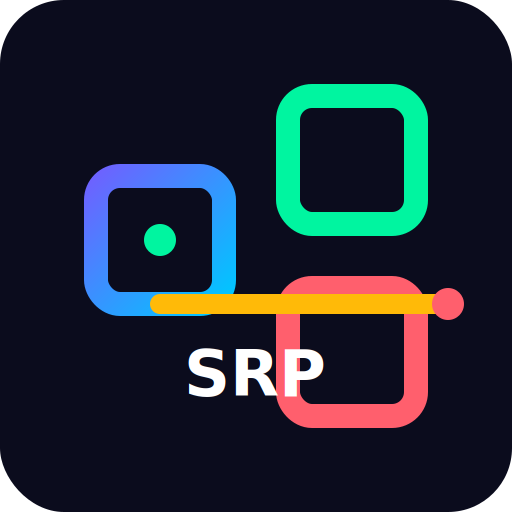

# Simplify.Result.Pattern

<p align="center">
  
</p>

Reusable Result pattern primitives and ASP.NET Core extensions that keep your API responses predictable, strongly typed, and ready to ship to NuGet.

## Why use it?

- **Single contract** for successes, validation errors, conflicts, and infrastructure failures.
- **Zero duplicate plumbing** – convert any `Result<T>` to an `IActionResult` with one method call.
- **Side-effect hooks** via `OnSuccess` and `OnFailure` so you can log, audit, or publish domain events.
- **Optional data envelope** – pass `wrapInData: true` to `Success` and return `{ "data": ... }` without rewriting controllers.
- **NuGet packaging ready** – every build emits `.nupkg`/`.snupkg`, so publishing is just a push away.

## Installation

```bash
dotnet add package Simplify.Result.Pattern
```

Or pack it locally from this repository:

```bash
dotnet pack src/Simplify.Result.Pattern/Simplify.Result.Pattern.csproj -c Release
```

## Quick start

```csharp
using Microsoft.AspNetCore.Mvc;
using Simplify.Result.Pattern.Extensions;
using Simplify.Result.Pattern.Results;

[ApiController]
[Route("[controller]")]
public class WeatherForecastController : ControllerBase
{
    [HttpGet("{name}")]
    public IActionResult GetByName(string name)
    {
        if (string.IsNullOrWhiteSpace(name))
        {
            return Result<IEnumerable<string>>
                .ValidationError(["Name is required."])
                .ToObjectResult();
        }

        var results = GetForecasts(name);

        if (!results.Any())
        {
            return Result<IEnumerable<string>>
                .NotFound($"No forecast for '{name}'.")
                .ToObjectResult();
        }

        return Result<IEnumerable<string>>
            .Success(results, wrapInData: true)
            .OnSuccess(values => _logger.LogInformation("Returned {Count} entries", values.Count()))
            .ToObjectResult();
    }
}
```

## Supported result types

| Type        | Status code | Helper                                                  |
|-------------|-------------|---------------------------------------------------------|
| Success     | 200 OK      | `Result<T>.Success(value, statusCode: optional)`        |
| Created     | 201 Created | `Result<T>.Created(value, actionName, routeValues)`     |
| NoContent   | 204         | `Result<T>.NoContent()`                                 |
| NotFound    | 404         | `Result<T>.NotFound(message)`                           |
| Validation  | 422         | `Result<T>.ValidationError(errors)`                     |
| Conflict    | 409         | `Result<T>.Conflict(message)`                           |
| Unauthorized| 401         | `Result<T>.Unauthorized(message)`                       |
| Failure     | 500         | `Result<T>.Failure(ResultType.Failure, errors/messages)`|

`ResultExtension.ToObjectResult()` maps each type to the correct `IActionResult`, including payloads and error envelopes.

Need JSON shaped as `{ "data": ... }`? Set the optional `wrapInData` flag when building the success result:

```csharp
var response = Result<MyDto>.Success(dto, wrapInData: true).ToObjectResult();
// => 200 OK with { "data": { ... } }
```

## Project layout

```
src/
├── Simplify.Result.Pattern/        # NuGet-packable library
└── Simplify.Result.Pattern.Tests/  # xUnit tests for the Result pipeline
```

Key files:

- `src/Simplify.Result.Pattern/Results/Result.cs` – core generic Result implementation with factory helpers.
- `src/Simplify.Result.Pattern/Enums/ResultType.cs` – centralized list of supported states.
- `src/Simplify.Result.Pattern/Extensions/ResultExtension.cs` – MVC integration + hook helpers.
- `src/Simplify.Result.Pattern.Tests/` – xUnit suite covering the Result pipeline end-to-end.

## Build, test, and pack

```bash
dotnet restore Result.Pattern.sln
dotnet test Result.Pattern.sln           # runs unit tests and packs the library (GeneratePackageOnBuild=true)
dotnet pack src/Simplify.Result.Pattern/Simplify.Result.Pattern.csproj -c Release
```

To publish the generated package to nuget.org:

```bash
dotnet nuget push src/Simplify.Result.Pattern/bin/Release/Simplify.Result.Pattern.<version>.nupkg \
  --api-key <NUGET_API_KEY> \
  --source https://api.nuget.org/v3/index.json
```

## Automated publishing

The repository ships with `.github/workflows/publish.yml`, which:

- runs on every `v*` tag push or manual dispatch;
- restores, tests, and packs the library;
- embeds the project logo (`logo.png`) inside the NuGet package via `<PackageIcon>`;
- pushes the `.nupkg` to nuget.org when the `NUGET_API_KEY` secret is configured.

Tagging the repository (for example `v1.2.3`) is enough to trigger the pipeline and publish a versioned package with the same icon used throughout this README.

## Contributing

1. Keep namespaces under `Simplify.Result.Pattern.*`.
2. Add new result types by updating `ResultType`, creating helper factories in `Result<T>`, and mapping them inside `ResultExtension`.
3. Cover behavioral changes with tests in `src/Simplify.Result.Pattern.Tests`.

MIT licensed. See `LICENSE` for details.
